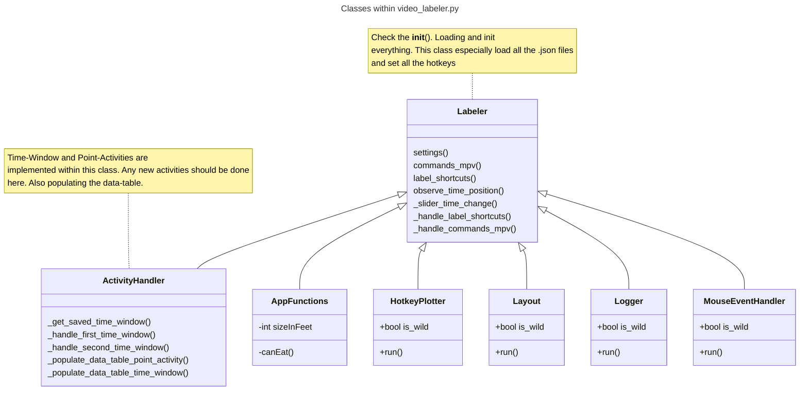

<style>
r { color: Red }
o { color: Orange }
g { color: Green }
</style>

The idea behind the video-labeler is to tag time-window and point-activities.


- Point-Activity: happens at a single point on a timeline  (....<r>TAG</r>......<r>TAG</r>.....)
- Time-Window: happens between two point on a timeline (...<r>FIRST_TAG.....SECOND_TAG</r>......)


### Requirements
```
pip install -r requirements.txt
```


### Folder Structure
```
├── data 
│   ├── .csv
│   └── .csv
├── videos 
│   ├── .mp4
│   ├── .avi
│   └── .                                   all types supported by mpv player
├── Hotkeys.png                             (if created)
├── commands_mpv.json                       (setting for mpv player)
├── label_shortcuts.json                    (hotkeys for labeling)
├── settings.json                           (hotkeys and settings for the app)
├── requirements.txt
└── video_labeler.py                        (run this to start)
```

### Start app (Video Labeler)

```
python video_labeler.py
```

text = 'Implemented both types, 
time-window and point-acitivities. Writting 
data into the data_table. If any new activities 
needs to be implemented, should be done here'




- Put some videos inside the "videos" folder
- Run video_labeler.py
- Setup the .json files (shortcuts etc.)

