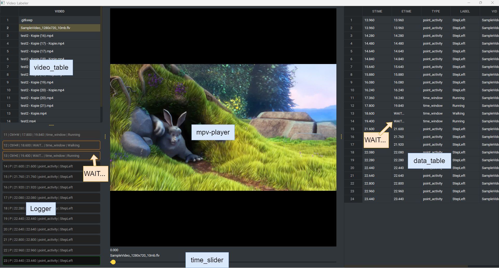
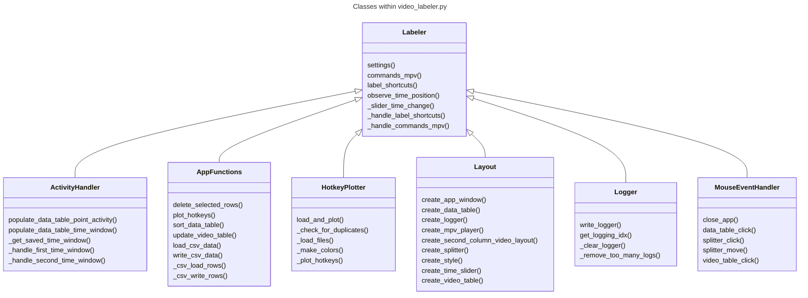
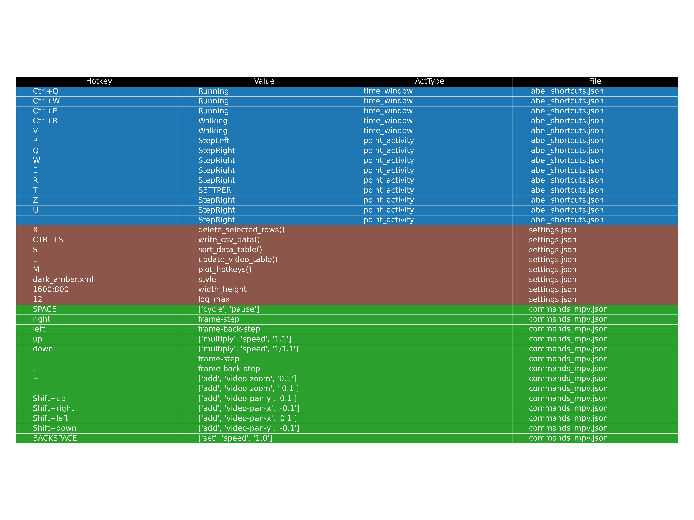

<style>
r { color: Red }
o { color: Orange }
g { color: Green }
</style>

The idea behind the video-labeler is to tag time-window and point-activities.


- Point-Activity: happens at a single point on a timeline  (....<r>TAG</r>......<r>TAG</r>.....)
- Time-Window: happens between two point on a timeline (...<r>FIRST_TAG.....SECOND_TAG</r>......)




### Requirements
```
pip install -r requirements.txt
```


### Folder Structure
```
├── data 
│   ├── .csv
│   └── .csv
├── videos 
│   ├── .mp4
│   ├── .avi
│   └── .                                   all types supported by mpv player
├── Hotkeys.png                             (if created)
├── commands_mpv.json                       (setting for mpv player)
├── label_shortcuts.json                    (hotkeys for labeling)
├── settings.json                           (hotkeys and settings for the app)
├── requirements.txt
└── video_labeler.py                        (run this to start)
```

### Start app (Video Labeler)

```
python video_labeler.py
```

### Class Description

- Labeler
  - Check the __init__(). Loading and init 
    everything. This class especially load all the .json files
    and set all the hotkeys. Also to bring everything together
- ActivityHandler
  - Time-Window and Point-Activities are
    implemented within this class. Any new activities should be done
    here. Also populating the data-table.
- AppFunctions
  - Any function that can be set up within 
    settings.json is within this class.
- HotkeyPlotter
  - Plotting an overview named Hotkeys.png.
    Also checks for duplicated Hotkeys. Marked as red inside image.
- Layout
  - Creating all the widgets.
- Logger
  - Handling logging-window (bottom left of the app).
- MouseEventHandler
  - Any mouse-event that needs to be handled
    is done here.



### .json-Files as Configurations

Take care of duplicated Hotkeys within .json-Files. 

---
[commands_mpv.json](commands_mpv.json)

[examples1](https://github.com/mpv-player/mpv/blob/master/etc/input.conf)

[examples2](https://mpv.io/manual/stable/#command-interface)

Every hotkey for the MPV-Player can be set here.

---

- label_shortcuts.json
- settings.json

---
[settings.json](settings.json)

Any method from AppFunctions ([video_labeler.py](video_labeler.py)) 
can be accessed with "()" at the end of the values. 

- "log_max" is for the Logger. Defines what max. number
of logs should be shown.
- "style" https://pypi.org/project/qt-material/ changing
the them of the app.
- "width_height" initial width:height
- plot_hotkeys() creates Hotkeys.png with all shortcuts. Also shows 
if there are duplicated values

- update_video_table() If there are always new incoming videos within 
the folder "videos" probably you will need this function.
- sort_data_table() sorts all the values within the data_table by "STIME"

Example
```json
{
  "X": "delete_selected_rows()",
  "CTRL+S": "write_csv_data()",
  "S": "sort_data_table()",
  "L": "update_video_table()",
  "M": "plot_hotkeys()",
  "dark_amber.xml": "style",
  "1600:800": "width_height",
  "12": "log_max"
}
```
